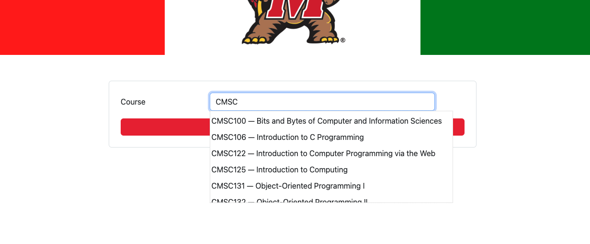
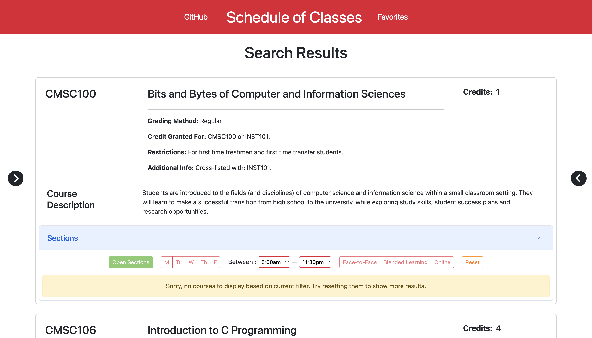
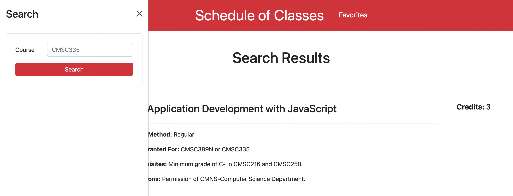

# Testudo-Revamp

## Accessing the Service Online

We have deployed the web service using Render.com. You can visit us at [testudo2-0.onrender.com/](https://testudo2-0.onrender.com/).

## Running the Server Locally

You are able to run this server locally on your computer using NodeJS. Start by extracting the contents of this file and run the following commmand within the directory.

```shell
npm install
```

This will install all the modules required for Testudo-Revamp to run properly. The next step is to simply start the server locally by running

```shell
node index.js
```

The server can be accessed at [localhost:3000](http://localhost:3000).

---
 
## Welcome to the Revamped Version of Testudo


To view a live demo of our project, check out this [YouTube Video](https://youtu.be/HxArLlzoiEo).

The goal of this project is to make viewing class schedules a lot easier, with a new minimalistic design and additional tools to help make faster decisions for course registrations. This is a WIP, but so far, we've implemented some of the core functionalities, as described below:

---

### Searching for Courses



By entering a properly formatted Course ID (`DEPTNNN`), users will be able to see more information about each specific course, from the course description, credits, and restrictions that students should know about; to the sections available, seating availability, and meeting locations.



Need to make another search? Access the search bar through the little arrow button on the left.



More features will be integrated in the future.

---

### Saving Courses

You can also add your favorite courses for later access, by clicking on the cute little star button on the right side of each section.


Your favorite courses can then be accessed through the Favorites page accessed at the top navbar.


---

### Credits

This project would not be possible without [UMD.IO](https://beta.umd.io/)'s wonderful API, and our beloved instructor [Nelson Padua-Perez](https://www.cs.umd.edu/~nelson/).

And of course, to the people that collaborated into this project:

- [Samuel A. Kosasih](https://github.com/SamAdrn) (samadrn)
- [Nathan Bezualem](https://github.com/nathanb9) (nathanb9)
- [Rose M. Griffin](https://github.com/rosegriffin) (rgriff68)
- [Alexander A. Ortunio](https://github.com/vladodio) (aortunio)

[Bootstrap v5.2](https://getbootstrap.com/) was used to create this design, and [MongoDB](https://www.mongodb.com/home) as a back-end database.

---

### Known Issues

1. At this point, courses searched must be a valid course. Entering them partially into the search bar will return a `400` bad request error code, as there is no middle-man between the form and the API. In the future, we will be looking into changing our back-end architecture to support this feature.

2. The time it takes for a course to be saved may vary. At times, the star will turn gold as quick as `100`ms, but in others, it may take up to `78000`ms.

3. Home page is very icky right now.

4. Course search results may be out of sync with Testudo. This might be an issue with UMD.IO's scraper [github.com/umdio/umdio/issues/241](https://github.com/umdio/umdio/issues/241).

---

> Written [12/14/2022]
